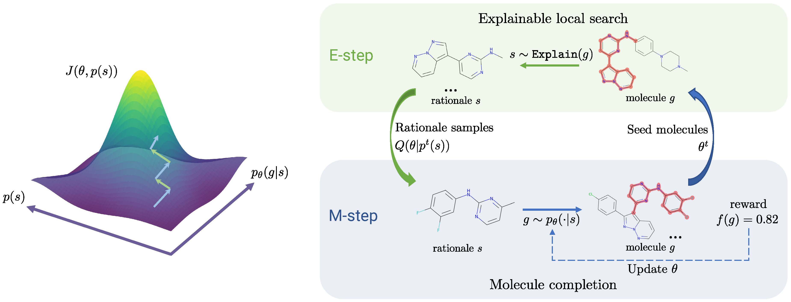

# Molecule Optimization by Explainable Evolution
    @inproceedings{Chen2021MolEvol,
        title={Molecule Optimization by Explainable Evolution},
        author={Binghong Chen* and Tianzhe Wang* and Chengtao Li and Hanjun Dai and Le Song},
        booktitle={International Conference on Learning Representations},
        year={2021}
    }

Project for finding synthesizable molecules with multiple properties.

## Overview
We release the PyTorch code for the MolEvol. [[Paper](https://openreview.net/pdf?id=jHefDGsorp5)]:

  

## Install Dependencies
You should install dependencies for chemprop and multiobj-rationale first.
    
#### Install chemprop
    conda create -n chemprop python=3.8
    conda activate chemprop
    conda install pytorch==1.6.0 torchvision==0.7.0 -c pytorch
    conda install -c conda-forge rdkit
    pip install -r requirements.txt
    pip install chemprop
    
#### Install multiobj-rationale
    cd ..
    git clone git@github.com:anonymous20201002/multiobj-rationale.git
    cd multiobj-rationale
    pip install -e .
    cd ../mol_finder
    
## How to Use
For instance, if you want to optimize jnk3,gsk3,QED,SA for the molecules jointly.

Run the following command:

    export CUDA_VISIBLE_DEVICES=0
    export TF_CPP_MIN_LOG_LEVEL=2
    export PYTHONPATH=$PWD
    python mol_finder/main.py --rounds=10 --epoch=1
    
You will get the molecule optimization model along with the optimized molecules in the experiment folder.
